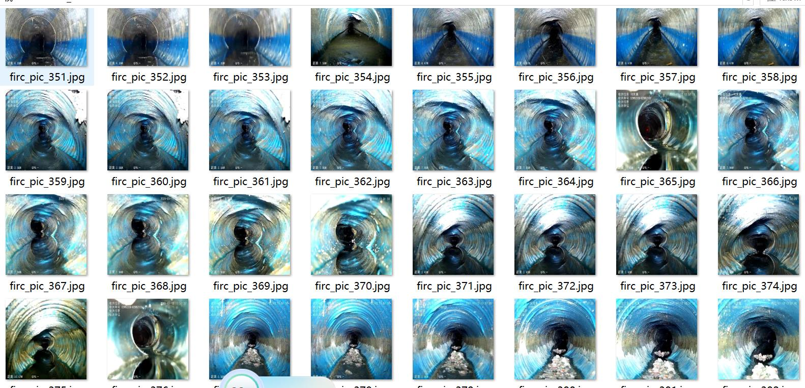
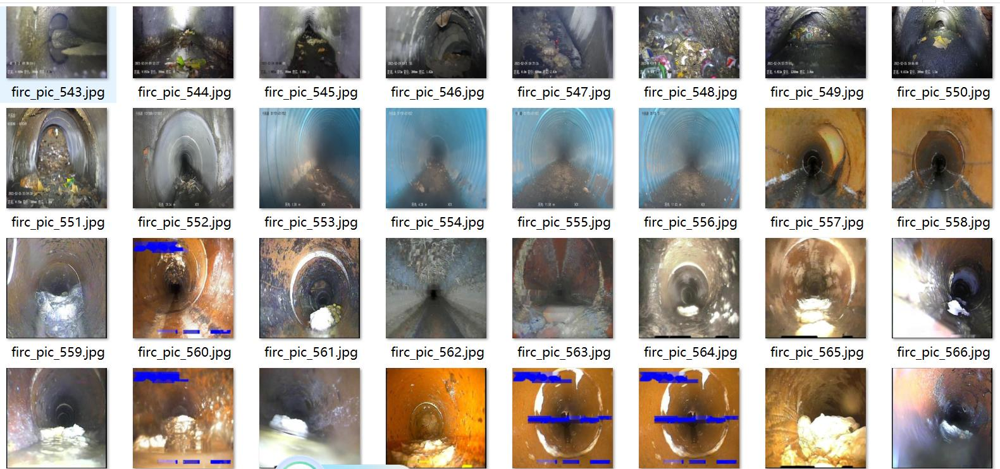
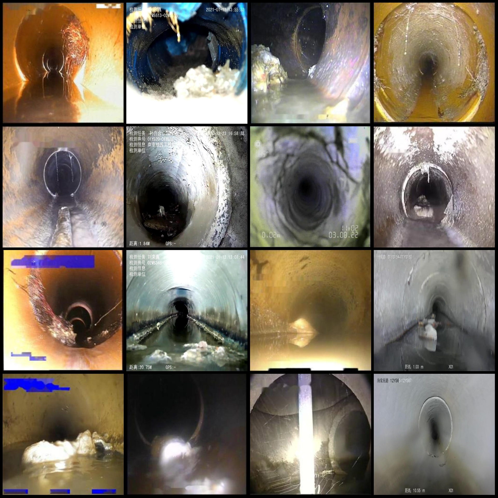
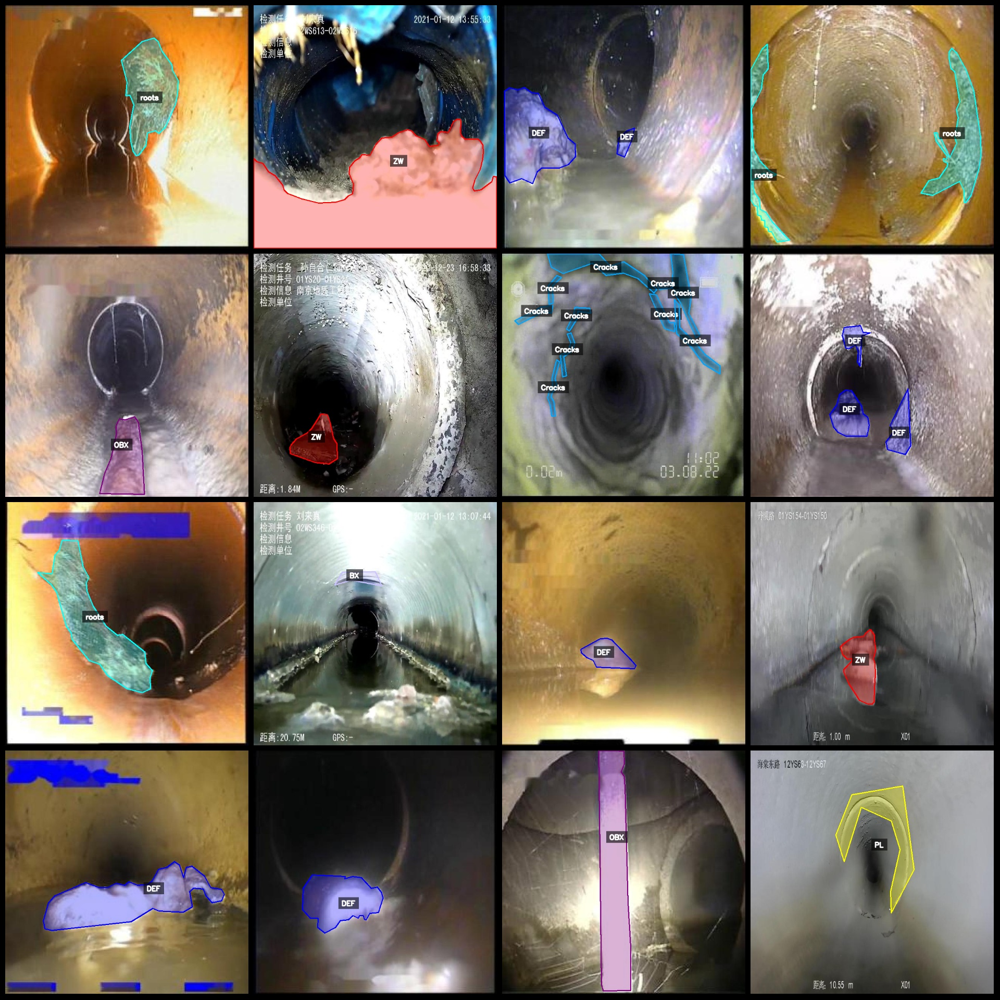
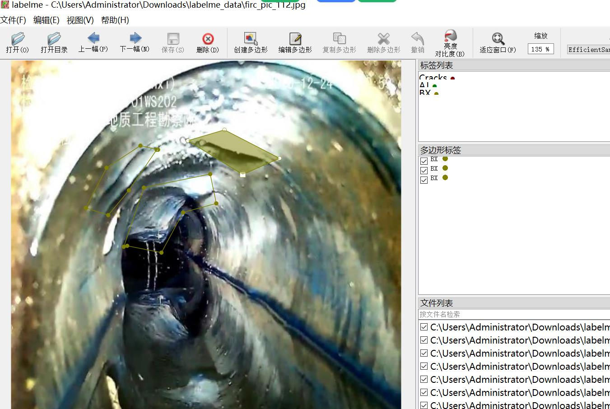

# LabelMe Dataset of Drainage Pipeline Defect Identification and Segmentation in 12 Categories

Dataset format: LabelMe format (without maskfile, only including jpgimage and corresponding jsonfile)
number of images: 3890  
annotation count: 3890  
annotationnumber of classes: 12  
annotation class names:["AJ","BX","CJ","Cracks","DEF","DES","OBB","OBX","PL","QF","ZW","roots"]  
boxes per class:   
AJ(Cracks) count = 98  
BX(Distortion) count = 549  
CJ(Deposition) count = 51  
Cracks(Fracture) count = 112  
DEF(Displacement) count = 936  
DES(Separation) count = 1062  
OBB(Irregular Objects, such as stones, bricks, etc.) count = 115  
OBX(Irregular Objects) count = 203  
PL(Plugging) count = 214  
QF(Connection Points) count = 68  
ZW(Garbage) count = 1191  
roots(Roots) count = 1326
total boxes: 5925  
Use the annotation tool: labelme=5.5.0
image resolution: 640x640  
Annotation rules: Draw a polygon around the class for polygons.
Important notes: You can open and edit the dataset with labelme, and the JSON dataset needs to be converted into mask or Yolo format or COCO format for semantic segmentation or instance segmentation.
Special statement: This dataset does not guarantee the accuracy of the trained model or weight file.
Image preview:
Annotation example:
Original image (select one of 16 images randomly):
Annotation drawing result:
Labelme editing image example:
## Images

Here is a pay link on Stripe ( https://buy.stripe.com/3cs8yP7sY87d0vu9AB ). Please contact me lonlonago@foxmail.com after funding $89, and I will send you a complete data files , thank you!

